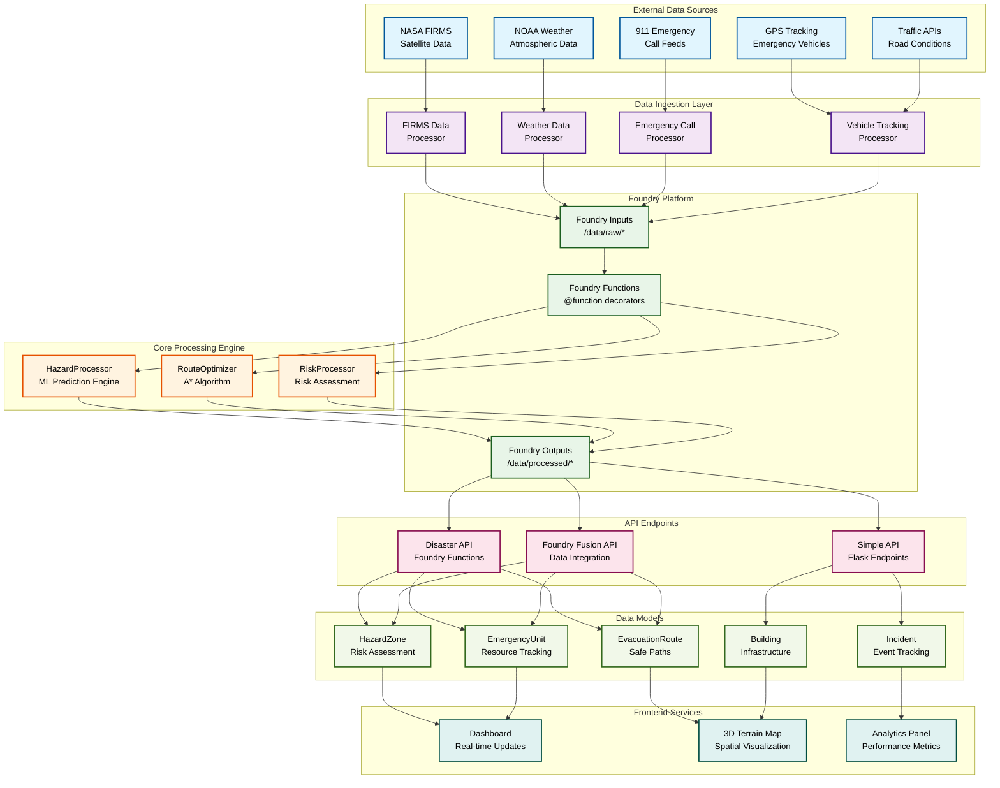

# Disaster Response Backend API Architecture Diagram

## System Overview

The Disaster Response Backend API is a sophisticated, multi-layered system that processes real-time emergency data, provides ML-powered hazard analysis, calculates safe evacuation routes, and coordinates emergency resources through a Foundry-based architecture.

## Architecture Diagram



## Detailed Component Breakdown

### 1. Data Ingestion Layer

#### NASA FIRMS Integration
- **Purpose**: Satellite fire detection data processing
- **Data**: Brightness temperature, confidence scores, coordinates
- **Processing**: H3 spatial indexing, confidence calculation
- **Output**: GeoDataFrame with fire detection points

#### NOAA Weather Integration
- **Purpose**: Atmospheric condition monitoring
- **Data**: Wind vectors (u_wind, v_wind), temperature, humidity
- **Processing**: Wind speed/direction calculation, spatial indexing
- **Output**: Weather conditions with spatial coordinates

#### Emergency Call Processing
- **Purpose**: Real-time 911 incident tracking
- **Data**: Call location, incident type, priority level
- **Processing**: Geocoding, incident categorization
- **Output**: Structured emergency incident data

### 2. Core Processing Engine

#### HazardProcessor
```python
class HazardProcessor:
    - ML Model: RandomForest for spread prediction
    - Spatial Indexing: H3 hexagons (~174m resolution)
    - Prediction Horizon: 2 hours
    - Features: Weather, terrain, historical data
```

**Key Methods:**
- `process_firms_data()`: NASA satellite data processing
- `process_weather_data()`: NOAA weather data processing
- `predict_hazard_spread()`: ML-powered spread prediction
- `calculate_risk_zones()`: Risk assessment and zoning

#### RouteOptimizer
```python
class RouteOptimizer:
    - Algorithm: A* pathfinding with hazard avoidance
    - Buffer Distance: 500m hazard avoidance
    - Vehicle Constraints: Type-specific limitations
    - Real-time Updates: Traffic and hazard integration
```

**Key Methods:**
- `calculate_safe_route()`: Hazard-avoiding route calculation
- `_build_routing_graph()`: Graph construction with penalties
- `_calculate_astar_route()`: A* algorithm implementation
- `_calculate_route_metrics()`: Performance and safety metrics

### 3. API Endpoints Architecture

#### Foundry Functions (Primary API)
```python
@function decorators for:
- get_hazard_summary(): Hazard zone overview
- get_hazard_zones_geojson(): Spatial data for mapping
- get_evacuation_routes(): Safe evacuation paths
- get_risk_assessment(): Location-specific risk analysis
- calculate_safe_route_api(): Advanced routing with constraints
- get_evacuation_status(): Evacuation progress tracking
- get_resource_coordination(): Emergency resource management
- get_public_safety_status(): Public-facing safety info
```

#### Flask API (Simple Endpoints)
```python
Flask routes for:
- /api/disaster-data: Comprehensive disaster response data
- /api/health: System health monitoring
- /api/update-resource-status: Resource status updates
- /api/add-alert: Emergency alert management
```

#### Foundry Fusion API (Data Integration)
```python
Blueprint for:
- Real-time data fusion and caching
- Analytics calculation and aggregation
- Multi-source data synchronization
- Performance optimization and monitoring
```

### 4. Data Models

#### Core Entities
- **HazardZone**: Risk assessment with H3 spatial indexing
- **EmergencyUnit**: Resource tracking with status management
- **EvacuationRoute**: Safe path calculation with metrics
- **Building**: Infrastructure risk assessment
- **Incident**: Event tracking and management

#### Spatial Data Structure
```python
H3 Resolution: 9 (~174m hexagons)
Coordinate System: EPSG:4326 (WGS84)
Geometry Types: Point, LineString, Polygon
Spatial Indexing: R-tree for efficient queries
```

### 5. Data Flow Architecture

#### Real-Time Processing Pipeline
```
1. External Data Sources → Data Ingestion
2. Data Ingestion → Foundry Inputs
3. Foundry Inputs → Processing Functions
4. Processing Functions → Core Engines
5. Core Engines → Foundry Outputs
6. Foundry Outputs → API Endpoints
7. API Endpoints → Frontend Services
```

#### Spatial Data Processing
```python
# H3 Spatial Indexing
h3_resolution = 9  # ~174m hexagons
gdf['h3_index'] = gdf.apply(
    lambda row: h3.latlng_to_cell(row['latitude'], row['longitude'], h3_resolution), 
    axis=1
)

# Spatial Analysis
location_point = Point(longitude, latitude)
buffer_wgs84 = location_point.buffer(radius_km * 1000)
nearby_hazards = hazard_gdf[hazard_gdf.geometry.intersects(buffer_wgs84)]
```

### 6. Performance Optimizations

#### Caching Strategy
- **Hazard Data**: 5-minute cache intervals
- **Route Calculations**: Hazard-based invalidation
- **Resource Positions**: 30-second real-time updates
- **Analytics**: Aggregated data caching

#### Spatial Optimization
- **H3 Hexagons**: Efficient spatial queries
- **R-tree Indexing**: Fast geometric operations
- **Spatial Buffering**: Optimized proximity calculations
- **Batch Processing**: Bulk data operations

### 7. Integration Points

#### Foundry Platform
- **Data Sources**: All raw data through Foundry Inputs
- **Processing**: Hazard and route processing as Functions
- **Outputs**: Processed data written back to Foundry
- **Real-time Updates**: WebSocket connections for live data

#### Frontend Services
- **REST API**: JSON endpoints for dashboard data
- **WebSocket**: Real-time updates for live tracking
- **GeoJSON**: Spatial data for mapping visualization
- **CORS**: Cross-origin support for web frontend

### 8. Security & Reliability

#### Data Validation
- **Input Sanitization**: Coordinate and parameter validation
- **Geometry Validation**: Spatial data integrity checks
- **Type Checking**: Strong typing throughout pipeline
- **Error Handling**: Graceful degradation with fallbacks

#### Monitoring & Logging
- **Structured Logging**: Comprehensive logging with structlog
- **Health Checks**: API endpoint monitoring
- **Performance Metrics**: Real-time performance tracking
- **Error Reporting**: Detailed error logging and reporting

This architecture provides a robust, scalable foundation for emergency response coordination with real-time data processing, ML-powered predictions, and comprehensive API coverage for all disaster response needs.
