# Disaster Response API Endpoints Diagram

## API Structure Overview

The Disaster Response Backend provides three main API interfaces: Foundry Functions (primary), Flask endpoints (simple), and Foundry Fusion API (data integration). Each serves different use cases and integration patterns.

## API Endpoints Diagram

```mermaid
graph TB
    %% API Entry Points
    subgraph "API Entry Points"
        FOUNDRY[Foundry Platform<br/>@function decorators]
        FLASK[Flask Server<br/>/api/* endpoints]
        FUSION[Foundry Fusion<br/>/api/foundry/*]
    end

    %% Foundry Functions
    subgraph "Foundry Functions (Primary API)"
        HS["get_hazard_summary<br/>Hazard zone overview"]
        HG["get_hazard_zones_geojson<br/>Spatial data for mapping"]
        ER["get_evacuation_routes<br/>Safe evacuation paths"]
        RA["get_risk_assessment<br/>Location risk analysis"]
        SR["calculate_safe_route_api<br/>Advanced routing"]
        ES["get_evacuation_status<br/>Evacuation progress"]
        RC["get_resource_coordination<br/>Resource management"]
        PS["get_public_safety_status<br/>Public safety info"]
    end

    %% Flask Endpoints
    subgraph "Flask API (Simple Endpoints)"
        DD["/api/disaster-data<br/>Comprehensive data"]
        HC["/api/health<br/>System health"]
        URS["/api/update-resource-status<br/>Resource updates"]
        AA["/api/add-alert<br/>Alert management"]
    end

    %% Foundry Fusion API
    subgraph "Foundry Fusion API (Data Integration)"
        FS["get_fused_state<br/>Complete data state"]
        HA["get_hazard_analytics<br/>Hazard analytics"]
        UA["get_unit_analytics<br/>Unit analytics"]
        RA2["get_route_analytics<br/>Route analytics"]
        SA["get_system_analytics<br/>System performance"]
    end

    %% Data Sources
    subgraph "Data Sources"
        HZ["hazard_zones<br/>/data/processed/hazard_zones"]
        SR2["safe_routes<br/>/data/processed/safe_routes"]
        RP["resource_positions<br/>/data/processed/resources"]
        BD["building_data<br/>/data/processed/buildings"]
        ID["incident_data<br/>/data/processed/incidents"]
    end

    %% Processing Engines
    subgraph "Processing Engines"
        HP["HazardProcessor<br/>ML predictions"]
        RO["RouteOptimizer<br/>A* routing"]
        RP2["RiskProcessor<br/>Risk assessment"]
    end

    %% Frontend Consumers
    subgraph "Frontend Consumers"
        DASH["Dashboard<br/>Real-time metrics"]
        MAP["3D Terrain Map<br/>Spatial visualization"]
        ANALYTICS["Analytics Panel<br/>Performance data"]
        COMMANDER["AIP Commander<br/>Decision support"]
    end

    %% Foundry Function Connections
    FOUNDRY --> HS
    FOUNDRY --> HG
    FOUNDRY --> ER
    FOUNDRY --> RA
    FOUNDRY --> SR
    FOUNDRY --> ES
    FOUNDRY --> RC
    FOUNDRY --> PS

    %% Flask Endpoint Connections
    FLASK --> DD
    FLASK --> HC
    FLASK --> URS
    FLASK --> AA

    %% Fusion API Connections
    FUSION --> FS
    FUSION --> HA
    FUSION --> UA
    FUSION --> RA2
    FUSION --> SA

    %% Data Source Connections
    HZ --> HS
    HZ --> HG
    HZ --> ER
    HZ --> RA
    HZ --> SR
    HZ --> ES
    HZ --> RC
    HZ --> PS

    SR2 --> HS
    SR2 --> ER
    SR2 --> SR
    SR2 --> ES

    RP --> RC
    RP --> UA
    BD --> PS
    ID --> AA

    %% Processing Engine Connections
    HP --> HZ
    RO --> SR2
    RP2 --> HZ

    %% Frontend Consumer Connections
    HS --> DASH
    HG --> MAP
    ER --> MAP
    SR --> MAP
    RC --> COMMANDER
    PS --> DASH
    FS --> ANALYTICS
    HA --> ANALYTICS
    UA --> COMMANDER
    RA2 --> ANALYTICS

    %% Styling
    classDef entry fill:#e3f2fd,stroke:#1976d2,stroke-width:2px,color:#000000
    classDef foundry fill:#e8f5e8,stroke:#388e3c,stroke-width:2px,color:#000000
    classDef flask fill:#fce4ec,stroke:#c2185b,stroke-width:2px,color:#000000
    classDef fusion fill:#fff3e0,stroke:#f57c00,stroke-width:2px,color:#000000
    classDef data fill:#f3e5f5,stroke:#7b1fa2,stroke-width:2px,color:#000000
    classDef processing fill:#e0f2f1,stroke:#00695c,stroke-width:2px,color:#000000
    classDef frontend fill:#f1f8e9,stroke:#558b2f,stroke-width:2px,color:#000000

    class FOUNDRY,FLASK,FUSION entry
    class HS,HG,ER,RA,SR,ES,RC,PS foundry
    class DD,HC,URS,AA flask
    class FS,HA,UA,RA2,SA fusion
    class HZ,SR2,RP,BD,ID data
    class HP,RO,RP2 processing
    class DASH,MAP,ANALYTICS,COMMANDER frontend
```



## API Endpoint Details

### 1. Foundry Functions (Primary API)

#### Hazard Management
- **`get_hazard_summary`**: Returns overview of current hazard zones and safe routes
  - Input: `hazard_zones`, `safe_routes`
  - Output: Summary statistics, risk distribution, affected population
  - Use Case: Dashboard overview, system status monitoring

- **`get_hazard_zones_geojson`**: Provides hazard zones as GeoJSON for mapping
  - Input: `hazard_zones`
  - Output: GeoJSON with metadata for spatial visualization
  - Use Case: 3D terrain map, spatial analysis

- **`get_risk_assessment`**: Calculates risk for specific location
  - Input: `hazard_zones`, coordinates, radius
  - Output: Risk scores, nearby hazards, safety recommendations
  - Use Case: Location-specific safety assessment

#### Route Planning
- **`get_evacuation_routes`**: Finds safe evacuation paths avoiding hazards
  - Input: `hazard_zones`, `safe_routes`, origin/destination coordinates
  - Output: Safe routes with hazard avoidance information
  - Use Case: Emergency evacuation planning, route optimization

- **`calculate_safe_route_api`**: Advanced routing with vehicle constraints
  - Input: `hazard_zones`, `road_network`, coordinates, vehicle type
  - Output: Optimized route with safety metrics
  - Use Case: Emergency response routing, civilian evacuation

#### Emergency Coordination
- **`get_evacuation_status`**: Tracks evacuation progress by zone
  - Input: `hazard_zones`, `evacuation_zones`, `shelter_locations`
  - Output: Evacuation progress, population at risk, shelter locations
  - Use Case: Evacuation management, shelter coordination

- **`get_resource_coordination`**: Manages emergency resource deployment
  - Input: `hazard_zones`, `resource_positions`
  - Output: Resource availability, nearest hazards, assignment status
  - Use Case: Emergency response coordination, resource allocation

- **`get_public_safety_status`**: Public-facing safety information
  - Input: `hazard_zones`, address or coordinates
  - Output: Safety status, evacuation recommendations, multi-language support
  - Use Case: Public safety communications, emergency notifications

### 2. Flask API (Simple Endpoints)

#### Main Data Endpoint
- **`/api/disaster-data`**: Comprehensive disaster response data
  - Method: GET
  - Response: Hazards, routes, resources, metrics, alerts
  - Use Case: Frontend dashboard, data integration

#### System Management
- **`/api/health`**: System health monitoring
  - Method: GET
  - Response: API status, version information
  - Use Case: System monitoring, health checks

- **`/api/update-resource-status`**: Resource status updates
  - Method: POST
  - Request: Resource ID, new status, location
  - Use Case: Real-time resource tracking, status updates

- **`/api/add-alert`**: Emergency alert management
  - Method: POST
  - Request: Alert type, location, severity, description
  - Use Case: Incident reporting, alert creation

### 3. Foundry Fusion API (Data Integration)

#### Data Fusion
- **`get_fused_state`**: Complete fused data state
  - Response: Hazards, units, routes, analytics
  - Use Case: Real-time data synchronization, comprehensive state

#### Analytics
- **`get_hazard_analytics`**: Hazard-specific analytics
  - Response: Risk distribution, spread patterns, affected areas
  - Use Case: Risk analysis, trend monitoring

- **`get_unit_analytics`**: Emergency unit analytics
  - Response: Unit availability, response times, deployment status
  - Use Case: Resource optimization, performance monitoring

- **`get_route_analytics`**: Route performance analytics
  - Response: Route efficiency, hazard avoidance, capacity analysis
  - Use Case: Route optimization, capacity planning

- **`get_system_analytics`**: Overall system performance
  - Response: System metrics, performance indicators, health status
  - Use Case: System monitoring, performance optimization

## Data Flow Patterns

### Real-Time Data Flow
```
External Sources → Data Ingestion → Foundry Inputs → Processing Functions → Foundry Outputs → API Endpoints → Frontend Services
```

### Caching Strategy
- **Hazard Data**: 5-minute cache intervals with real-time updates
- **Route Calculations**: Hazard-based cache invalidation
- **Resource Positions**: 30-second real-time updates
- **Analytics**: Aggregated data with configurable cache intervals

### Error Handling
- **Graceful Degradation**: Fallback to cached data on failures
- **Input Validation**: Comprehensive parameter and coordinate validation
- **Error Logging**: Structured logging with error context
- **Health Monitoring**: Continuous endpoint health checks

## Integration Examples

### Frontend Dashboard Integration
```typescript
// Fetch comprehensive disaster data
const response = await fetch('/api/disaster-data');
const data = await response.json();

// Access different data types
const { hazards, routes, resources, metrics, alerts } = data;

// Real-time updates via WebSocket
const ws = new WebSocket('ws://localhost:8000/ws');
ws.onmessage = (event) => {
    const update = JSON.parse(event.data);
    updateDashboard(update);
};
```

### Foundry Function Integration
```python
# Call Foundry function for hazard summary
@function(
    hazard_zones=Input("/data/processed/hazard_zones"),
    safe_routes=Input("/data/processed/safe_routes")
)
def get_hazard_summary(hazard_zones, safe_routes):
    # Process data and return summary
    return summary_data
```

### Spatial Data Integration
```python
# Get hazard zones as GeoJSON for mapping
hazard_geojson = get_hazard_zones_geojson(hazard_zones)

# Use in 3D terrain visualization
map.addSource('hazards', {
    'type': 'geojson',
    'data': hazard_geojson
});
```

This API structure provides comprehensive coverage for disaster response operations with multiple integration patterns, real-time data processing, and robust error handling for mission-critical applications.
