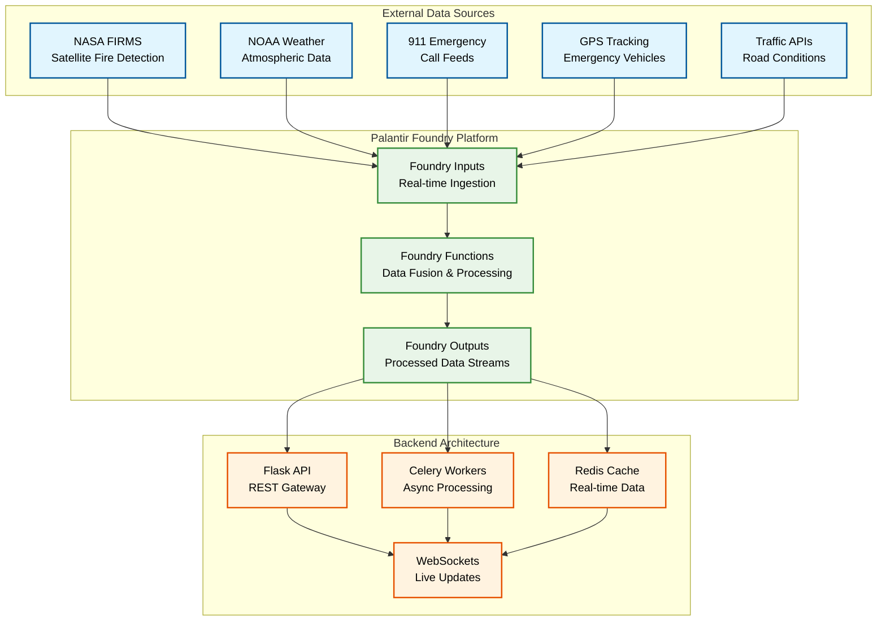

# Slide 3: Data Sources → Foundry → Backend

## Real-time Data Pipeline

### Chart Description
This flow diagram visualizes the complete data pipeline from external sources through Palantir Foundry to the backend architecture, demonstrating the sophisticated real-time data processing capabilities.

### Mermaid Chart

### Key Components

#### External Data Sources
- **NASA FIRMS**: Satellite fire detection with brightness temperature and confidence scores
- **NOAA Weather**: Wind vectors, temperature, humidity, and atmospheric conditions
- **911 Emergency**: Real-time emergency call feeds and incident data
- **GPS Tracking**: Emergency vehicle location and status data
- **Traffic APIs**: Road conditions, closures, and traffic flow data

#### Palantir Foundry Platform
- **Foundry Inputs**: Real-time data ingestion and validation
- **Foundry Functions**: Data fusion, processing, and transformation
- **Foundry Outputs**: Processed data streams ready for consumption

#### Backend Architecture
- **Flask API**: REST gateway for synchronous data access
- **Celery Workers**: Asynchronous processing for complex calculations
- **Redis Cache**: Real-time data storage and caching
- **WebSockets**: Live updates and real-time communication

### Technical Impact
This diagram demonstrates:
- **Enterprise Integration**: Multiple external data sources
- **Real-time Processing**: Live data fusion and processing
- **Scalable Architecture**: Async processing with caching
- **Modern Stack**: Flask, Celery, Redis, WebSockets

### Export Information
- **Filename**: `slide3_data_sources_to_backend.png`
- **Size**: 216 KB
- **Dimensions**: 1920x1080 (Full HD)
- **Theme**: Dark theme with high contrast
- **Colors**: Blue (external), Green (Foundry), Orange (backend)
