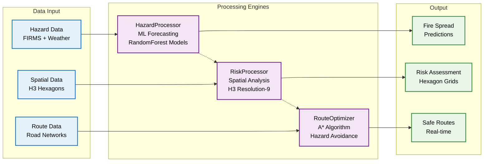

# Slide 4: Processing Engines

## ML-Powered Decision Engines

### Chart Description
This process flow diagram visualizes the three specialized processing engines that power intelligent decision-making in the disaster response system, showing how data flows through ML models and spatial analysis to produce actionable insights.

### Mermaid Chart

### Key Components

#### Data Input Layer
- **Hazard Data**: FIRMS satellite data + NOAA weather conditions
- **Spatial Data**: H3 hexagonal grid system (~174m resolution)
- **Route Data**: Road networks, traffic conditions, and constraints

#### Processing Engines
- **HazardProcessor**: ML forecasting using RandomForest models for fire spread prediction
- **RiskProcessor**: Spatial analysis using H3 resolution-9 hexagons for risk assessment
- **RouteOptimizer**: A* algorithm with hazard avoidance for optimal pathfinding

#### Output Layer
- **Fire Spread Predictions**: ML-powered forecasting of hazard progression
- **Risk Assessment**: Spatial risk zones using hexagonal grids
- **Safe Routes**: Real-time optimized evacuation paths

### Technical Impact
This diagram demonstrates:
- **ML Integration**: RandomForest models for predictive analytics
- **Spatial Intelligence**: H3 hexagonal grid system for efficient spatial processing
- **Advanced Algorithms**: A* pathfinding with hazard avoidance
- **Real-time Processing**: Live updates and continuous optimization

### Processing Flow
1. **Data Ingestion**: Multiple data sources feed into specialized processors
2. **Parallel Processing**: Three engines work simultaneously on different aspects
3. **Cross-Communication**: Engines share data for comprehensive analysis
4. **Output Generation**: Real-time predictions, risk assessments, and routes

### Export Information
- **Filename**: `slide4_processing_engines.png`
- **Size**: 287 KB
- **Dimensions**: 1920x1080 (Full HD)
- **Theme**: Dark theme with high contrast
- **Colors**: Blue (input), Purple (engines), Green (output)
