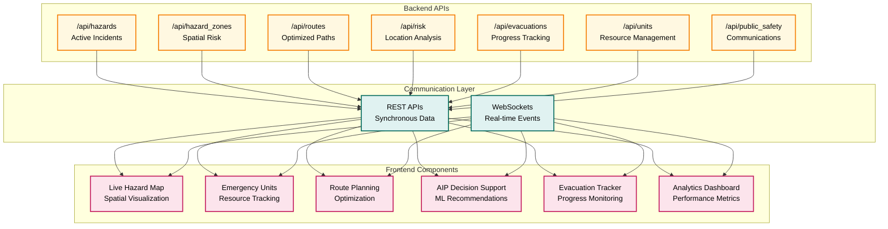

# Slide 5: API Surface → Frontend

## API Integration Architecture

### Chart Description
This architecture diagram visualizes the complete API surface and its integration with frontend components, showing how REST APIs and WebSockets work together to provide both synchronous data access and real-time updates to the user interface.

### Mermaid Chart

### Key Components

#### Backend APIs
- **/api/hazards**: Active incident data and real-time hazard information
- **/api/hazard_zones**: Spatial risk assessment and zone boundaries
- **/api/routes**: Optimized evacuation paths and route calculations
- **/api/risk**: Location-specific risk analysis and assessment
- **/api/evacuations**: Progress tracking and evacuation status
- **/api/units**: Resource management and emergency unit tracking
- **/api/public_safety**: Public communications and emergency alerts

#### Communication Layer
- **REST APIs**: Synchronous data access for initial loads and specific requests
- **WebSockets**: Real-time event streaming for live updates and notifications

#### Frontend Components
- **Live Hazard Map**: Spatial visualization of hazards and conditions
- **Emergency Units Panel**: Resource tracking and unit management
- **Route Planning Panel**: Optimization interface and route selection
- **AIP Decision Support**: ML recommendations and intelligent guidance
- **Evacuation Tracker**: Progress monitoring and status updates
- **Analytics Dashboard**: Performance metrics and operational insights

### Technical Impact
This diagram demonstrates:
- **Comprehensive API Surface**: Complete coverage of emergency response needs
- **Dual Communication**: Both REST and WebSocket patterns for optimal UX
- **Component Integration**: Seamless connection between backend and frontend
- **Real-time Capabilities**: Live updates across all interface components

### API Design Principles
1. **RESTful Design**: Standard HTTP methods and resource-based URLs
2. **Real-time Updates**: WebSocket connections for live data streaming
3. **Component-Specific APIs**: Tailored endpoints for each frontend panel
4. **Unified Interface**: Consistent API patterns across all services

### Export Information
- **Filename**: `slide5_api_surface_to_frontend.png`
- **Size**: 305 KB
- **Dimensions**: 1920x1080 (Full HD)
- **Theme**: Dark theme with high contrast
- **Colors**: Orange (APIs), Teal (communication), Pink (frontend)
