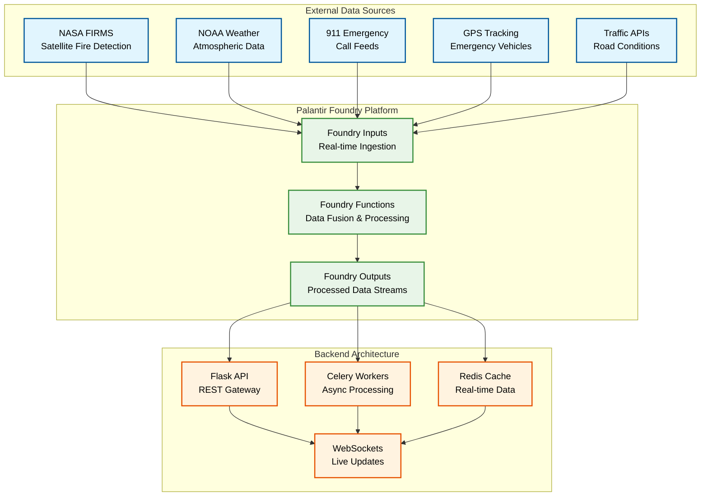
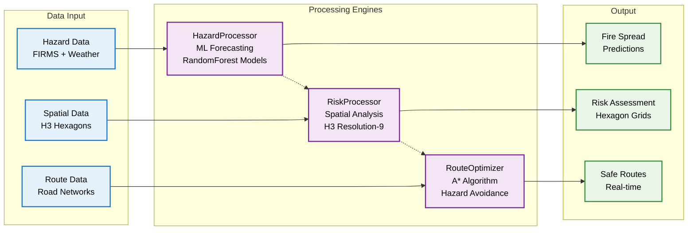
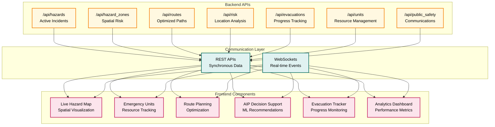

# Technical Insert Mermaid Charts

## Slide 3: Data Sources → Foundry → Backend

### Flow Diagram: Real-time Data Pipeline



---

## Slide 4: Processing Engines

### Process Flow: ML-Powered Decision Engines



---

## Slide 5: API Surface → Frontend

### Architecture Diagram: API Integration



---

## Slide 10: Request Lifecycle

### Sequence Diagram: Async Route Planning

```mermaid
sequenceDiagram
    participant UI as Frontend UI
    participant API as Flask API
    participant CELERY as Celery Worker
    participant REDIS as Redis Cache
    participant WS as WebSocket
    
    UI->>API: POST /api/routes<br/>{origin, destination, profile}
    API->>API: Validate request
    API->>CELERY: Submit route calculation job
    API->>UI: 202 Accepted<br/>{jobId: "route_123"}
    
    Note over CELERY: Processing Route
    CELERY->>CELERY: Load hazard data
    CELERY->>CELERY: Calculate A* path
    CELERY->>CELERY: Apply constraints
    CELERY->>CELERY: Optimize route
    
    CELERY->>REDIS: Store route result
    CELERY->>WS: route_ready event<br/>{jobId: "route_123"}
    
    WS->>UI: WebSocket message<br/>route_ready
    
    UI->>API: GET /api/routes/route_123
    API->>REDIS: Retrieve route data
    API->>UI: Route response<br/>{geometry, eta, distance, hazards}
    
    Note over UI: Update map with route
    Note over UI: Display ETA and distance
    Note over UI: Show hazard avoidance
    
    classDef frontend fill:#e3f2fd,stroke:#1976d2,stroke-width:2px,color:#000000
    classDef backend fill:#e8f5e8,stroke:#388e3c,stroke-width:2px,color:#000000
    classDef cache fill:#fff3e0,stroke:#e65100,stroke-width:2px,color:#000000
    
    class UI frontend
    class API,CELERY,WS backend
    class REDIS cache
```

---

## Chart Integration Notes

### **Technical Specifications**
- **Chart Type**: Mermaid diagrams with custom styling
- **Color Scheme**: Consistent with slide theme (dark backgrounds, high contrast)
- **Text Color**: #000000 (black) for maximum readability
- **Stroke Width**: 2px for clear visibility
- **Font**: System fonts for compatibility

### **Integration Options**
1. **Static PNG Export**: Convert to high-resolution images
2. **HTML Embed**: Direct Mermaid.js integration
3. **Video Animation**: Animate chart elements for dynamic presentation

### **Expected Impact**
- **Technical Credibility**: Visual proof of sophisticated architecture
- **Understanding**: Complex concepts become immediately clear
- **Professional Presentation**: Enterprise-grade technical diagrams
- **Recruiter Satisfaction**: Directly addresses architecture requirements

### **Next Steps**
1. Export charts as PNG images
2. Integrate into slide generation process
3. Test visual quality and readability
4. Optimize for video presentation format
